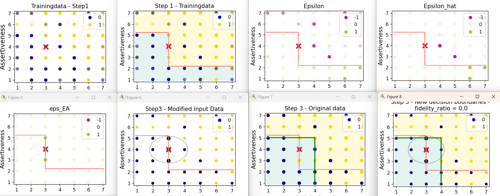

# How to run Error Amplification
## Tidy code is in: 
````commandline
./base_mode/Algorithms_Dez2023/.
````

## Installation python packages
- graphviz
- matplotlib
- seaborn
- scikit-learn
- (re) = regex -> ist ggfs. schon vorinstalliert?
- jsons
- datetime
- openpyxl
- git clone https://github.com/Mereep/HDTree.git (see: https://github.com/Mereep/HDTree)

## 1. Define Decision-Tree Parameters in json-file
Define the parameters that are needed for running the decision trees in a json file: 
e.g. in file `read_dec_tree_parameters.json` \
````commandline
{ "circle_radius_factor": 2,
  "randomstate": 40,
  "trainingset": 75,
  "max_depth": 2,
  "min_samples_leaf": 2,
  "min_samples_split": 2,
  "which_cost_fct": "RelativeAccuracyMeasure",
  "do_upsamplin" : false,
  "ccp_alpha": 0
}
````
- `circle_radius_factor`: `[int]` Radius of the neighborhood circle for error amplification
- `randomstate`: `[int]` Random Generator number for reproducibility (Usually, don't change it.)
- `trainingset`: `[int]` Percentage of how to split data into Training- & Testset.
- `max_depth`: `[int]` Maximum depth of Decision Tree.
- `min_samples_leaf`: `[int]` Minimum number of samples per leaf in the Decision Tree.
- `min_samples_split`: `[int]` Minimum number of samples that should remain in a leaf, while splitting. (Decision Tree)
- `which_cost_fct`: `[str]`Which Cost-Function to use. Choose between: `'RelativeAccuracyMeasure', 'Entropy'`, `'Gini''`
- `do_upsamplin`: `[bool]` Whether to do upsampling of the datapoints or not. 
- `ccp_alpha`: `[int or float]` Pruning parameter for decision trees in scikit-package. (Used in RandomForestClassifier) - 0 means no additional pruning. 

## 2. Define Data-Parameters in json file
e.g `read_Foundercheck_data.json`:
````commandline
{ "dir_to" : "C:/Users/dudkin/Documents/Projects/inAlco_ExplainableAI/bapcs_code/Speedinvest2/results_OneDrive/",
  "dir_data" : "C:/Users/dudkin/Documents/Projects/inAlco_ExplainableAI/6_Data - Copy/SIH/FC_data_for leadership_matching_anonymized.xlsx",
  "save_to_folder": "231128_FC_data_leadership_2features",
  "excel_sheet_name" : "Table_SCCH",
  "which_feature_set" : ["Activity Level", "Assertiveness"],
  "ylabel" : "Leadership match YES (1) / NO (0)",
  "person_id_label" : "Index",
  "header_column_in_row" : 2,
  "which_feature_setXX" : ["Activity Level", "Orientation on Norms"] ,
  "which_feature_setXX" : ["Activity Level", "Assertiveness"],
  "which_feature_setXX" : ["Activity Level", "Decisiveness"],
  "which_feature_setXX" : ["Activity Level", "Sociability"],
  "which_feature_setXX" : ["Activity Level", "Trust"],
  "which_feature_setXX" : ["Activity Level", "Willingness to Compromise"],
  "which_feature_setXX" : ["Activity Level", "Emotionality"],
  "which_feature_setXX" : ["Activity Level", "Intellectual Curiosity"]
}
````
- `dir_to`: `[str]` base directory, to which the results should be saved to.
- `dir_data`: `[str]` directory to the folder where the data is located.
- `save_to_folder`: `[str]` a new folder is created, to which the results are saved to.
- `excel_sheet_name`: `[str]` the name of the excel sheet, where the data is presented.
- `which_feature_set`: `[list of strings]` names of the features, that are considered. (Column names in the excel sheet.)
- `ylabel`:`[str]` column name which defines the y-labels 
- `person_id_label`:`[str]` column name of some indices (person-ID or Company-ID)
- `header_column_in_row`:`[int]` in which row are the column names located? (in which row are the features? In our current dataset it's in the second row.)
- `which_feature_setXX`: placeholders for the feature_sets. These keys are not used. Only when renamed to `"which_feature_set"`.

# 3. Infer Index of the data point of interest
Get the index of the data point of interest (person_id_to_check), while running the script:
`get_person_id.py`

Here you have to input the datapoint of interest, e.g. `datapoint_of_interest = [3,4]`, 
which means `x = 3`, `y = 4`.

This script will give you the output of a sub-dataframe, which matches 
your `datapoint_of_interest`. If there are multiple entries for the same 
data point, you will get a dataframe with multiple rows, e.g.:
````commandline
     y_train  Index  Activity Level  Assertiveness
27         1    135               3              4
179        1    157               3              4
242        0    244               3              4
````
Choose one person-id within the column `Index`. Be aware, that this datapoint
can have ambiguous `y_train`-labels (= y-labels)

# 4. Run _Error Amplification_ routine
Run the whole error amplification routine, while running: 
`script_run_error_amplification_routine.py`.
e.g.
````commandline
from base_model.error_amplification_hdtree import *

# Directory to json-file for Foundercheck Data.
json_data_dir = "base_model/read_Foundercheck_data.json"

# Directory to json-file for definition of decision_tree_parameters.
json_dec_tree_params = "base_model/read_dec_tree_parameters.json"

person_id_to_check = 244  # run the script: get_person_id.py, to infer the person_id_to_check. 

run_error_amplification_routine(json_data_dir,
                                json_dec_tree_params,
                                person_id_to_check)
````

This routine runs all 3 steps.
1. Step: Prediction with first Decision Tree (DT1)
2. Step: AI model error prediction (RandomForestClassifier) \
  Error Amplification (relabeling and creation of new modified data set)
3. Step: Prediction of new modified data set with second Decision Tree (DT2)

This routine will also give you all plots of the data, for the different steps.
You can find them saved in your defined directory `dir_to` & `save_to_folder`.

E.g. these figures are created, when running the routine:
